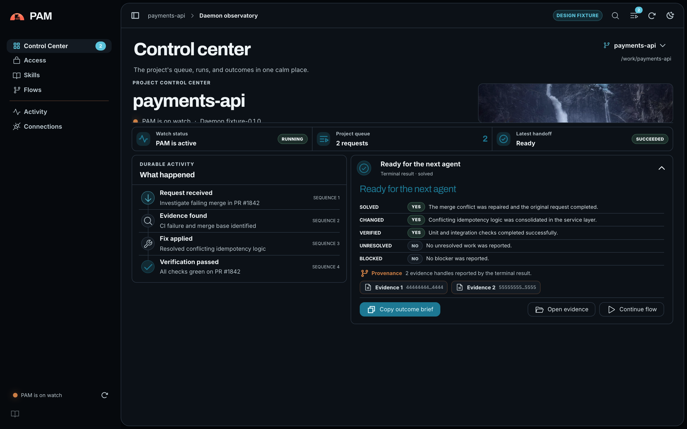
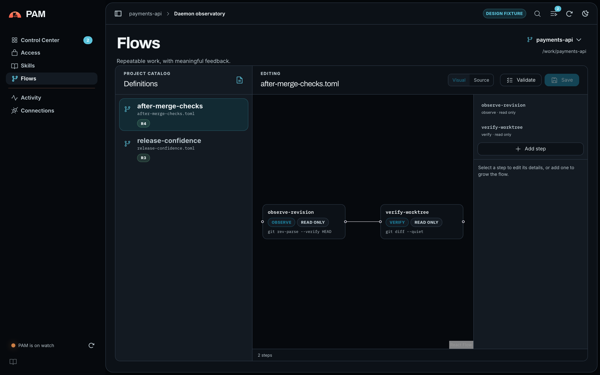
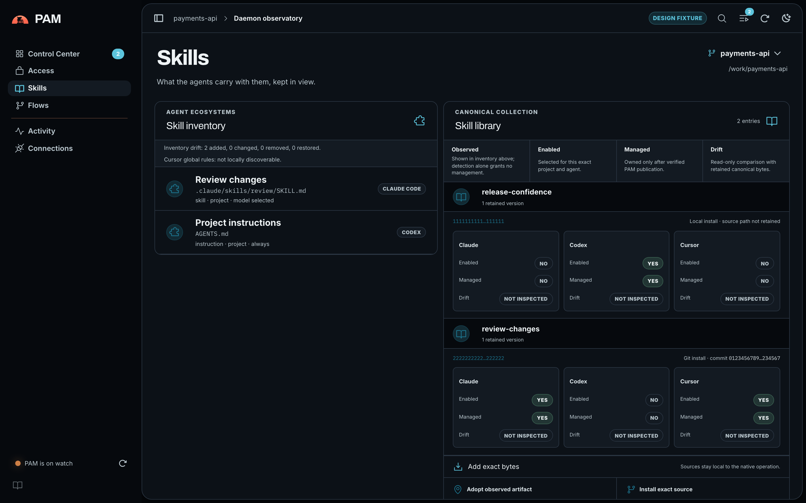
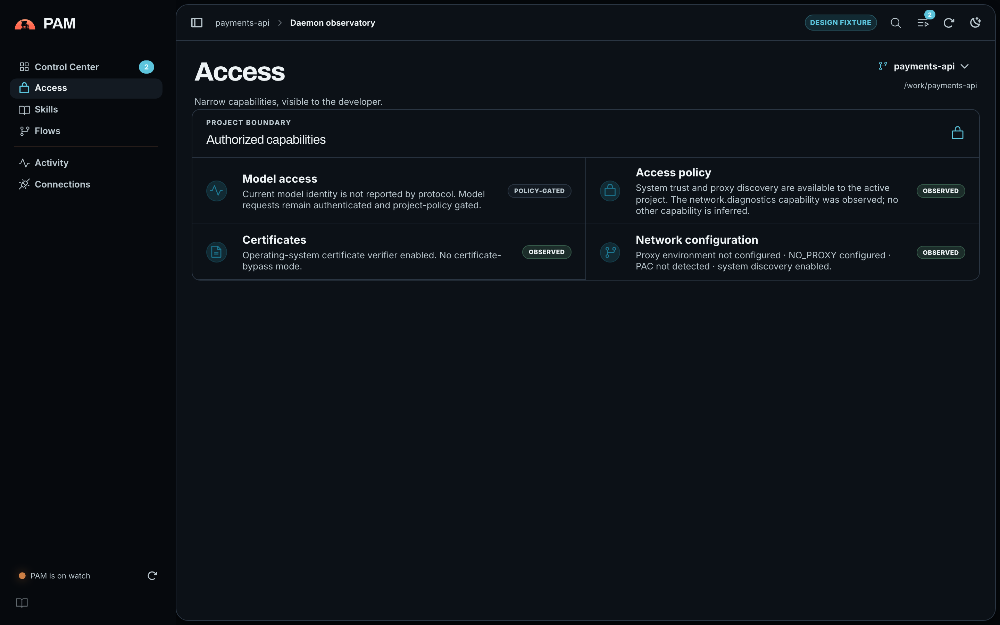
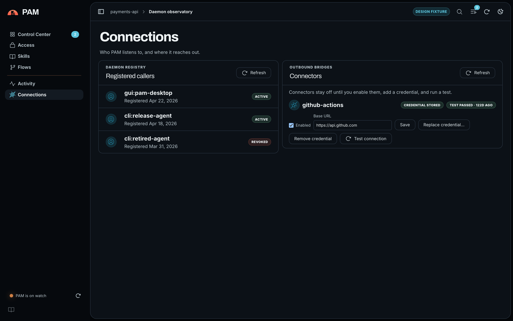
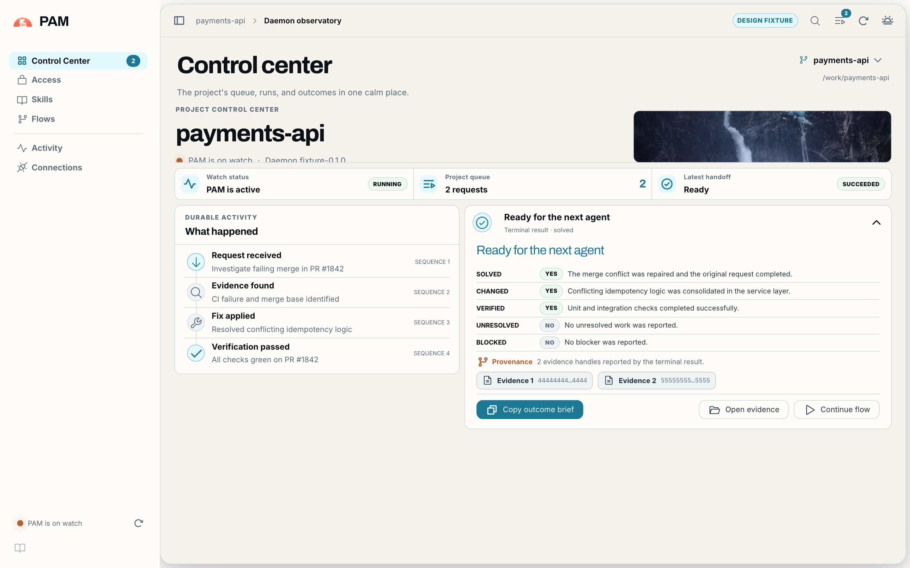
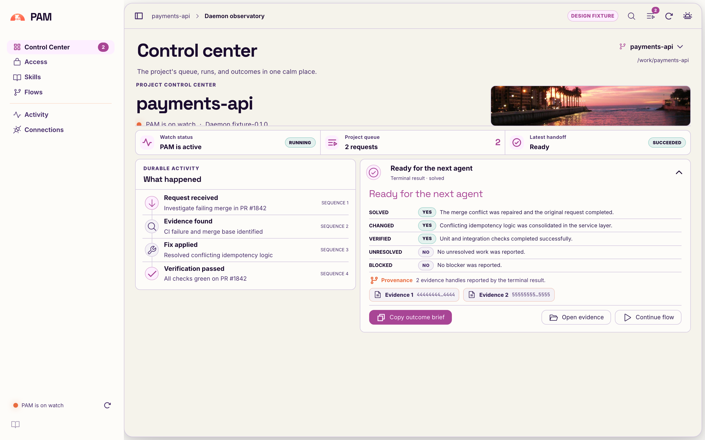
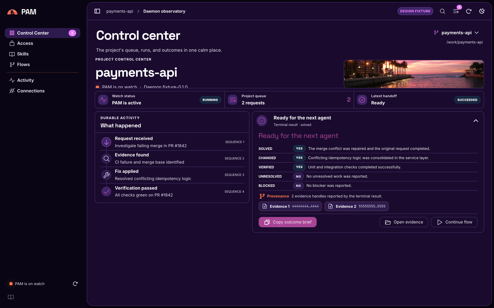

<p align="center">
  
</p>

<h1 align="center">PAM</h1>

<p align="center"><strong>A local lifeguard for developers and AI agents in corporate environments.</strong></p>

<p align="center">
  <a href="LICENSE"></a>
  <a href="https://github.com/ro-ag/pam/releases/latest"></a>
  <a href="https://github.com/ro-ag/pam/actions/workflows/ci.yml"></a>
  <a href="https://ro-ag.github.io/pam/"></a>
</p>

<p align="center">
  <a href="https://ro-ag.github.io/pam/">Help &amp; documentation site</a> ·
  <a href="https://github.com/ro-ag/pam/releases/latest">Download</a> ·
  <a href="docs/product-brief.md">Product brief</a> ·
  <a href="docs/architecture.md">Architecture</a> ·
  <a href="docs/roadmap.md">Roadmap</a>
</p>

---

PAM is Baywatch for developers and AI agents working inside corporate
environments: always on watch, confident, and ready with the verified project
story. It keeps durable context, turns noisy evidence into compact answers,
safely brokers approved tools, and runs repeatable flows without sending the
developer's workspace to a hosted control plane.

<p align="center">
  
</p>

```text
pam                         # client mode (default)
pam daemon                  # local background service
pam gui                     # launches the installed desktop control center
pam flow run "release check"
```

## Why PAM

Coding agents are capable, but corporate development work is fragmented across
build logs, Git, CI, SonarQube, Jira, Confluence, credentials, policy prompts,
and restrictive sandboxes. Agents also lose useful context when conversations
are compacted or restarted. PAM sits locally between agents and those systems,
preserving verified continuity and returning small, evidence-backed results.

PAM helps an agent answer:

- **What project am I acting on**, and what work is already in flight?
- **What actually failed**, where is the evidence, and what can PAM safely fix?
- **Which action requires human approval?**
- **What changed**, how was it verified, and what remains unresolved?

## The desktop control center

One `pam` binary ships three modes — client CLI, local daemon, and an embedded
Tauri control center (`pam gui`). Every screen below is the production React
interface rendering fixture data.

| | |
| --- | --- |
|  **Flows** — auditable, repeatable sequences edited visually or as TOML |  **Skills** — one global inventory, per-project assignment, drift kept in view |
|  **Access** — narrow capabilities, visible to the developer |  **Connections** — registered callers and connectors that stay off until enabled and tested |

Two theme families, each with a true light and dark variant:

| Ventisquero Mist | Viña del Mar Dawn |
| --- | --- |
|  |  |
|  |  |

## Product shape

- **Local first:** state, logs, policy, and model weights stay under the user's
  control by default.
- **Durable per-project queues:** callers share one project timeline without
  racing or repeating expensive work.
- **Safe capability bridge:** callers receive narrowly scoped access rather
  than inheriting every credential on the machine.
- **Compact evidence:** deterministic log reduction comes before optional local
  model summarization; original evidence is always addressable.
- **Flows:** developers compose auditable sequences in the GUI or as files and
  run them with `pam flow run "name"`.
- **Local inference:** PAM integrates with `llama.cpp`, helps acquire compatible
  models, and never ships model weights. The default model location is
  `~/llm/<vendor>/<model-name>.<extension>` unless the user chooses another.
- **Companion continuity:** PAM cooperates with tools such as `ptrack`
  through supported interfaces instead of taking ownership of their storage.
- **Connectors ship dormant:** corporate connectors are built in but inert
  until the user enables each one, stores its credential in the native
  credential store, and runs a connection test from the GUI.
- **Skills are global-first:** the skill inventory is managed once per machine,
  with per-project assignment on demand.

## Connectors

All connector operations are read-only, policy-gated, and audited; the GUI
Connectors panel lists whatever the daemon registers, so new connectors appear
without frontend changes.

| Connector | Surface | Credential |
| --- | --- | --- |
| GitHub Actions | workflow runs and logs | token |
| Jenkins | jobs, builds, console logs | `user:api-token` |
| SonarQube | quality gate, issues | token |
| Jira Data Center | projects, issues (JQL) | personal access token |
| Confluence Cloud | pages (CQL) | `email:api-token` |
| SharePoint (Microsoft Graph) | documents, lists | bearer token, sovereign-cloud base URL |
| AWS CLI passthrough | curated allowlist of read-only `aws` commands | none stored — the local CLI resolves the user's own `~/.aws` chain; an optional stored profile name is passed as `--profile` |

## Install

Grab the latest packaged build from the
[releases page](https://github.com/ro-ag/pam/releases/latest):

| Platform | Architecture | Package |
| --- | --- | --- |
| macOS 12+ | arm64 | signed, notarized DMG |
| Linux | amd64, arm64 | `tar.gz` |
| Windows | amd64, arm64 | `zip` |

Every package includes the matching `pam` helper binary. Project continuity
requires a local [`ptrack`](https://github.com/ro-ag/ptrack) installation;
desktop launches resolve it from `PAM_PTRACK_EXECUTABLE`, beside the
application, common per-user install directories such as `~/.local/bin`, and
finally `PATH`.

The [help site](https://ro-ag.github.io/pam/) has a step-by-step first-run
guide and troubleshooting for common installation issues.

## Quickstart (from source)

Register a caller and grant only the capabilities needed for the current
project:

```sh
cargo run --bin pam -- caller register
cargo run --bin pam -- access grant daemon.status --resource daemon
cargo run --bin pam -- access grant brief.read
```

Run the daemon from an initialized project in one terminal:

```sh
cargo run --bin pam -- daemon
```

Then, from a second terminal:

```sh
cargo run --bin pam -- status
cargo run --bin pam -- brief
```

The daemon runs in the foreground and shuts down cleanly on Ctrl-C. If an
interrupted daemon leaves stale local endpoint state, recover it explicitly
with `cargo run --bin pam -- daemon --recover`. The native GUI boundary is
available as `cargo run --bin pam -- gui`. `pam brief` requires `ptrack` to be
installed and initialized for that exact project root; otherwise it reports the
source as unavailable. Durable request observers use `pam wait <request-id>` and
`pam result <request-id>`. A brief's exact source can be inspected with
`pam evidence show <evidence-handle>` or written byte-for-byte with
`--raw`/`--output`.

### Approvals

If policy returns an approval challenge, decide it and retry that same
operation with the explicit one-time receipt:

```sh
cargo run --bin pam -- approval approve <approval-id>
cargo run --bin pam -- status --approval-id <approval-id>
```

`--approval-id <ID>` is available on the single-request `status`, `brief`,
`wait`, `result`, and `network diagnostics` commands. The receipt is attached
only to the command that explicitly supplies it; PAM does not read approval
authority from the environment.

`evidence show` deliberately does not accept an approval receipt. One evidence
download spans an inspection request followed by one or more bounded range-read
requests, while a one-time receipt authorizes exactly one protocol request and
cannot be reused across that sequence. A protocol client may retry the exact
challenged evidence request with its receipt.

## Local model

The first supported embedded model profile is the user-owned
Qwen3-Coder-30B-A3B-Instruct Q4_K_S artifact documented in
[docs/model-memory.md](docs/model-memory.md). Register its exact bytes and
accepted license snapshot; if policy denies the import, run the exact recovery
grant printed by PAM and retry the same command:

```sh
cargo run --bin pam -- model import \
  qwen/qwen3-coder-30b-a3b-instruct-q4-k-s \
  --path /absolute/path/to/Qwen3-Coder-30B-A3B-Instruct-Q4_K_S.gguf \
  --digest sha256:56a7d00783419bcb0ae566253c371bcb3678261bb79881a553539f5679864db4 \
  --size-bytes 17456012448 \
  --license-id Apache-2.0 \
  --license-url https://huggingface.co/Qwen/Qwen3-Coder-30B-A3B-Instruct/blob/b2cff646eb4bb1d68355c01b18ae02e7cf42d120/LICENSE \
  --license-notice-digest sha256:832dd9e00a68dd83b3c3fb9f5588dad7dcf337a0db50f7d9483f310cd292e92e \
  --accept-license
```

Start the daemon with that profile and invoke it over PAM's authenticated local
protocol. The first generation is default-denied until its printed exact-effect
grant is added; retry the identical request after granting it.

```sh
# Terminal 1
cargo run --bin pam -- daemon \
  --model qwen/qwen3-coder-30b-a3b-instruct-q4-k-s

# Terminal 2
cargo run --bin pam -- model generate \
  qwen/qwen3-coder-30b-a3b-instruct-q4-k-s \
  'Explain this Rust compiler error and propose the smallest safe fix.' \
  --tokens 256
```

Model loading is disabled unless the daemon receives `--model VENDOR/NAME`,
then fails closed on the 20 GB profile, fresh memory pressure, swap trend,
Metal working set, and OS/PAM reserves. The model path is text-only,
English-first, and intended for coding plus Python/SQL data analysis. It does
not expose an HTTP model endpoint. The embedded llama.cpp/Metal runtime
remains macOS-only; the portable desktop surfaces report that limitation
instead of implying a model is available.

## Security model

Local endpoint reachability is not authorization: callers authenticate, policy
is evaluated for the exact project/capability/resource, and required approvals
are consumed transactionally immediately before dispatch. Production requests
authenticate a registered, revocable caller whose secret is kept in the
operating system's native credential store. Project policy is default-deny with
explicit-deny precedence and exact-effect, one-time approvals. Native-trust
network diagnostics expose only sanitized configuration facts; audit export is
project-scoped and redacted; evidence and audit retention are explicit,
bounded, and crash-recoverable.

PAM nevertheless relies on the operating-system account and per-user
data-directory protections for local administrative CLI operations and direct
database access; an untrusted process with unrestricted execution as that same
user is inside the current administrative trust boundary.

See the [local daemon threat model](docs/security/local-daemon-threat-model.md)
for assets, actors, trust boundaries, current mitigations, planned hardening,
residual risks, severity calibration, and a test-linked validation matrix.

## Current status

The product foundation, walking skeleton, durable project-continuity, local
trust-and-policy, and desktop-control-center slices are implemented. The pinned
Rust workspace builds one `pam` binary with three modes — client (default,
covering status, brief, wait, result, evidence, caller, access, approval,
network-diagnostics, audit-export, and retention), `pam gui` for the embedded
Tauri control center, and `pam daemon` for the IPC daemon. The daemon durably
schedules per-project work in SQLite, recovers leases after restart, replays
ordered events, retains exact content-addressed evidence, and obtains project
context from `ptrack` only through its supported JSON CLI. The workspace also
contains a tested, deterministic log compactor and a bounded, directly embedded
llama.cpp runtime behind the existing authenticated PAM protocol; compactor
integration remains future work. LLMLingua-2 is recorded as a possible staged
semantic compressor, but is not integrated; it may load on demand and unload
before the selected model. The 20 GB ceiling applies to the active Qwen
profile, not installed tools.

The connector platform is implemented with seven read-only connectors (see
[Connectors](#connectors)). Flow authoring, service-manager integration,
peer-credential transport hardening, and screen-reader semantics remain later
roadmap slices. PAC evaluation and live managed enterprise CA/proxy behavior
are not claimed; no managed-environment interviews or workflow observations
have been conducted.

## Development

Local quality gates match the portable Linux checks:

```sh
cargo fmt --all -- --check
cargo check --workspace --all-targets --all-features --locked
cargo clippy --workspace --all-targets --all-features --locked -- -D warnings
cargo test --workspace --all-features --locked
```

The Tauri 2 shell packages the same typed Rust desktop core and React
interface for five native targets. GitHub Actions builds each target on a
native runner after the Linux Rust and frontend gates pass; the macOS job
signs with the hardened runtime, notarizes, and staples the app and DMG.
Pushing a `v*` tag runs the same package matrix and publishes a tagged GitHub
Release with notes taken from [CHANGELOG.md](CHANGELOG.md); no package
registry is published. Because this repository is public, short-lived CI
artifacts are public to repository readers.

For an unsigned local Apple Silicon build:

```sh
npm --prefix frontend ci
MACOSX_DEPLOYMENT_TARGET=12.0 \
  npm --prefix frontend run tauri -- build \
  --target aarch64-apple-darwin --bundles app
tools/package-macos-dmg.sh \
  "$PWD/target/aarch64-apple-darwin/release/bundle/macos/PAM.app" \
  "$PWD/target/aarch64-apple-darwin/release/bundle/dmg"
```

The React interface uses native HTML controls, DOM focus order, labeled
regions, keyboard shortcuts, reduced-motion behavior, and forced-color
fallbacks. The preview does not claim complete VoiceOver or WCAG conformance
until the full platform interaction matrix is independently verified. Plan 13
UI acceptance records current native-renderer evidence on the available macOS
host and Parallels Ubuntu guest, without claiming Windows or duplicate CPU
architectures as independently exercised UI surfaces.

## Documentation

- [Help &amp; documentation site](https://ro-ag.github.io/pam/) — install,
  first run, flows, connectors, troubleshooting
- [Product brief](docs/product-brief.md)
- [Research synthesis](docs/research.md)
- [Architecture](docs/architecture.md)
- [Local daemon threat model](docs/security/local-daemon-threat-model.md)
- [Stack decisions](docs/stack.md)
- [Roadmap](docs/roadmap.md)

## Contributing

The design is intentionally open before implementation hardens it. Please start
with the product brief and roadmap, then open an issue describing the user
problem, expected evidence, and security boundary. PAM is licensed under the
[Apache License 2.0](LICENSE). By contributing, you agree that your
contributions will be licensed under the same terms.
