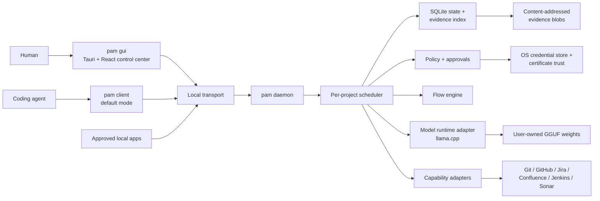
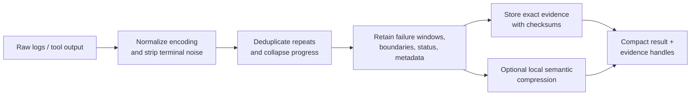

# Architecture

## Shape

Pam is distributed as one application artifact. Subcommands select a mode, but
all modes share the same versioned domain types and policy engine.

The GUI is a client of the same daemon protocol as the CLI. It may start and
stop the daemon, but it does not gain a private path around policy or durable
state.

## Runtime modes

| Invocation | Responsibility |
| --- | --- |
| `pam …` | Fast client; discovers project and caller, submits requests, streams events, and prints compact results. |
| `pam daemon` | Owns queues, durable state, connectors, policy, model runtime, and the authenticated local protocol. |
| `pam gui` | Native control center for daemon lifecycle, project queues, flows, models, access, certificates, and evidence. |

If the client cannot reach the daemon, it should provide an exact recovery
action. Automatic daemon start may be offered only when policy and installation
mode allow it.

## Identity and queueing

Caller identity and project identity are separate.

- A **caller** is a registered CLI session, coding-agent integration, GUI, or
  approved local application. It receives a revocable credential and declared
  capabilities.
- A **project** is resolved from explicit input, a `.pam/project.toml` marker,
  or a normalized repository root. Its stable ID must not depend only on a path
  that can move.
- A **request** carries protocol version, request ID, caller ID, project ID,
  capability, idempotency key, deadline, and payload.

Caller labels remain non-secret routing identities. A separate high-entropy
credential authenticates every request; Pam stores only its SHA-256 verifier and
uses a constant-time comparison. Registration and revocation are local-user
administrative operations against the protected per-user state database, not
network-reachable protocol capabilities. Revocation is immediate for subsequent
requests, survives daemon restart, and deliberately returns the same external
failure as an unknown caller or invalid credential. Re-registering a revoked
caller issues a new credential and invalidates the old one.

The CLI keeps that credential exclusively in the current user's native secure
store: login Keychain on macOS, Credential Manager on Windows, or Secret Service
on Linux. A caller-scoped, domain-separated hash is the native account key; the
caller label and credential do not enter project TOML. Native-store access is
lazy and runs on a blocking worker because an OS keyring may wait for a desktop
service or prompt the user. Headless or unavailable keyrings fail closed with
no plaintext fallback.

Corporate HTTP clients use rustls with the operating system's certificate
verifier, environment plus supported static system-proxy discovery, bounded
connect/request timeouts, and no certificate-bypass mode. The authenticated
`network.diagnostics` capability reports only configuration presence and safe
state codes: it never returns proxy URLs, hosts, userinfo, bypass-list contents,
or backend error text. PAC scripts are not evaluated by the selected HTTP stack;
PAC is reported as detected-but-unsupported when an injected native inspector
can establish its presence, and otherwise as inspection-unavailable rather than
claimed to be honored. Repository tests prove client wiring and redaction, not
live behavior in an authorized managed corporate environment.

Project policy is default-deny. Grants bind one caller, project, capability, and
either an exact resource or an explicit any-resource scope. Active explicit
denies override allows; expiry and revocation take effect at their recorded
millisecond boundary. Each grant mutation advances a durable project-policy
version.

Approval-required grants create a durable request bound to a collision-safe
SHA-256 fingerprint of the caller, project, capability, and exact resource.
Only a registered active local approver can approve or deny it. Approved
receipts are consumed transactionally at the policy gate, exactly once, before
the effect; mismatched, denied, expired, or previously consumed receipts never
authorize work. Protocol failures carry the approval ID and expiry without
exposing credentials.

Each project has one durable ordered queue. The scheduler serializes stateful or
conflicting operations. A flow can declare read-only collection steps safe for
parallel execution, but their results rejoin the ordered project event stream.
Global resources such as the model runtime have separate capacity controls so a
large inference request cannot starve every project.

## Protocol and transport

The application protocol is transport-neutral and versioned independently from
the binary. The first transport adapter uses ZeroMQ Router/Dealer semantics:

| Platform | First transport | Planned hardening |
| --- | --- | --- |
| macOS | ZeroMQ IPC endpoint in the per-user local-data runtime directory | launchd integration and signed peer registration |
| Linux | ZeroMQ IPC endpoint in the session runtime directory, with a per-user local-data fallback | systemd user service and peer credential checks |
| Windows | ZeroMQ IPC endpoint in the per-user local-data runtime directory | native service integration and signed peer registration |

ZeroMQ availability is a build/runtime implementation detail, never exposed in
the command contract. Message envelopes use Serde with a compact binary encoding
and an explicit maximum frame size. Large logs and artifacts are stored once and
referenced by content hash instead of traveling through IPC frames.

The daemon publishes a replayable event sequence per request. Reconnect uses a
request ID and last observed sequence number; it does not restart the work.

## Durable state

SQLite in WAL mode stores metadata, queues, leases, flow definitions and runs,
policy decisions, audit events, model registrations, and evidence references.
A dedicated database worker owns the connection behavior rather than allowing
unbounded blocking work on async executors.

Potentially large or sensitive evidence lives in a content-addressed blob
directory with checksums, size/type metadata, project ownership, retention, and
redaction state. A compact result stores references into this evidence graph.
Deletion and retention are explicit operations with audit events.

The durable audit ledger uses a global monotonic sequence while every export is
restricted to one project. The first bounded export page captures an inclusive
high-water sequence; later pages reuse it so concurrent appends cannot make an
export chase a moving tail. This is an append fence, not a long-lived database
snapshot: an operator should finish paging before running retention pruning.
The CLI emits versioned deterministic NDJSON to a new file with atomic
publication and no overwrite. Audit detail is redacted and made terminal-safe
before persistence, with both input-inspection and stored output bounds; the
store rejects controls and Unicode format characters in all ledger text fields.

Retention is explicit and bounded. Expired audit rows are deleted at their
inclusive retention timestamp. Evidence pruning requires a project, either the
`session` or `project` retention class, an inclusive creation-time cutoff, and a
batch limit; `persistent` evidence is deliberately excluded. The current
`session` label has no implicit process-lifetime identity, so Pam does not claim
automatic session expiry. Evidence handle deletion commits before physical CAS
cleanup. Blob cleanup then rechecks for references under SQLite writer
exclusion, never follows symlinks, and reports bytes it could not safely remove
as pending for a later bounded reconciliation pass. A durable install-intent
journal gives each put attempt ownership of its exact temporary file and makes
a blob published before a failed handle transaction discoverable after a crash,
while cleanup-attempt ordering prevents one unsafe entry from starving later
removable blobs. Cleanup reports exact committed counts separately from an
explicit unresolved state; it never converts an unknown amount into a numeric
claim. This ordering prevents a database rollback from restoring a live handle
after its blob was unlinked.

Pam integrates with `ptrack` through its supported command or future protocol.
It does not read or mutate `ptrack`'s database schema directly.

## Canonical skill library

Pam keeps exact skill bytes in an isolated, digest-addressed library below the
resolved p-track home's Pam namespace. The manifest records canonical entry
IDs, immutable versions, metadata-only installation provenance, and exact
project/agent enablement keys. Managed-copy ownership is additionally bound to
a non-sensitive identity of the validated canonical agent root, without storing
or exposing that root path. Live discovery remains a
separate observation: finding an artifact does not enable it, and enabling a
version does not claim that a destination was published or remains clean.

Replacement materialization is failure-atomic and no-clobber rather than a
continuous-pathname crash transaction. Pam atomically moves the live target to
a private sibling quarantine, verifies the held bytes, and publishes the new
file without replacement. If the process stops between those operations, the
exact prior bytes remain under `.pam-quarantine-*/previous-destination` for
explicit recovery; Pam never trades that recovery copy for silently overwriting
a non-cooperating writer.

The Desktop Access surface uses one strict, schema-versioned
`manage_skill_library` command. Its public authority is the existing opaque
project handle, generation, and fresh operation UUID; the Rust boundary derives
the internal library project key and never exposes it. Actions are explicit:
load, adopt, local or Git install, enable/disable, materialization
preview/apply, drift inspection, and resync preview/apply. Responses contain
only entry/version/agent identities, digests, byte counts, dispositions, typed
drift, and ownership outcomes. Explicit local paths and Git URLs exist only in
the submitted install form/request; source bytes, destination roots, backup
paths, and those request-only source values never return in a response or enter
the displayed library snapshot.

Desktop previews are advisory metadata, not write authority. Apply recomputes
and revalidates the exact plan in Rust. React rejects stale sequences, mismatched
fences, and substituted entry/version/agent identities; after a mutation it
loads library state again before presenting success. Switching project or
generation remounts the Access library and clears forms, previews, inspections,
and prior-project metadata.

## Evidence pipeline

Deterministic reduction always runs first. Model compression is optional,
policy-controlled, and never replaces the exact retained source. Every model
claim must cite an evidence handle or be labeled as an inference.

## Flow execution

A flow definition is data, not arbitrary daemon code. Initial step types are:

- run an allowlisted local command in a declared working directory;
- call a registered connector capability;
- transform or compact evidence;
- evaluate a condition over structured output;
- request human approval;
- emit a result or handoff.

The engine records a state transition before and after each externally visible
effect. Idempotency keys protect retries. Destructive, publishing, merging, or
ticket-mutating steps require policy evaluation at the point of effect, even if
the flow itself was previously approved.

## Security boundaries

1. **Caller boundary:** local reachability is not identity. Callers register and
   authenticate; credentials are revocable and never written to flow files.
2. **Project boundary:** evidence and policy are scoped to a stable project ID.
   Cross-project reads require a separate grant.
3. **Capability boundary:** connectors expose typed operations rather than raw
   secrets or a universal shell.
4. **Approval boundary:** Pam displays the exact effect, target, and evidence
   before a sensitive action.
5. **Network boundary:** connectors honor operating-system trust, corporate CAs,
   proxies, explicit destinations, and project egress policy.
6. **Model boundary:** untrusted prompts and tool output cannot authorize
   capabilities. Model output is data until validated by the engine.

Model inference uses the existing authenticated Pam IPC protocol and its
caller/project policy boundary. The daemon embeds llama.cpp in-process through
the Rust adapter; it does not open an HTTP listener, emulate an OpenAI API, or
export a bearer credential. Prompt and generated text are bounded, ephemeral,
excluded from audit detail, and treated as untrusted data. One active inference
and one queued request are allowed; excess work fails as busy.

## Portability rules

- Platform paths, IPC, credential stores, service managers, code signing, and
  hardware acceleration live behind interfaces with contract tests.
- Core queue, protocol, flow, policy, compaction, and evidence crates contain no
  platform UI or service-manager code.
- macOS may ship first, but portable tests run on Linux from the start.
- Windows-specific implementation begins only after protocol and path semantics
  are explicit; callers never assemble Unix-only paths.
